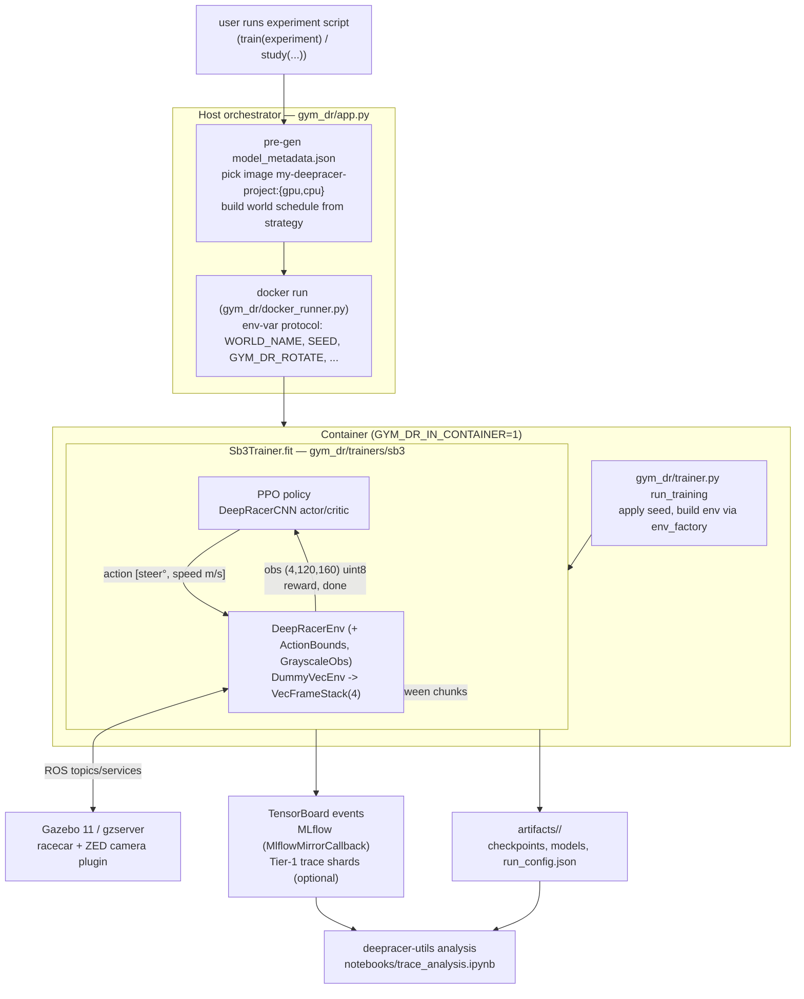

# System overview

How a training run flows across the three repos, end to end. Skim this first; the other docs drill in
(`configuration.md`, `algorithms.md`, `trace-contract.md`, `tracking.md`, `artifact-layout.md`,
`hpo.md`, `onnx-support-status.md`, `physical-car-integration-notes.md`).

## The three repos

| Repo | Role | Lang / stack |
|---|---|---|
| **`dr-gym`** | RL training stack: experiment config, SB3 PPO trainer, world scheduling, metrics/trace, MLflow + TensorBoard + Optuna, ONNX export & OpenVINO IR. | Python 3.8 |
| **`deepracer-env`** | The simulator. A `gymnasium.Env` (`DeepRacerEnv`) driving AWS DeepRacer in Gazebo over ROS. Computes reward params, runs reset rules, hot-swaps tracks. | ROS 1 Noetic + Gazebo 11, Python 3.8 |
| **`deepracer-utils`** | Off-line analysis of the dr-gym trace (stability, rliable, track-path plots). Reads the on-disk trace format; never imports dr-gym. | Python ≥3.8 |

**Coupling is deliberately schema-only:** dr-gym depends on `deepracer-env` at runtime (it constructs the
env), but the analysis seam between dr-gym and deepracer-utils is just the Tier-1 trace file format
(`docs/trace-contract.md`). Nothing in deepracer-utils imports `gym_dr`.

## Data flow

## One training step, concretely

1. **Host** (`gym_dr/app.py:train`, no `GYM_DR_IN_CONTAINER`): writes `model_metadata.json`, resolves the
   world schedule from `experiment.effective_strategy()`, and `docker run`s **one** container
   (`gym_dr/docker_runner.py:spawn_training_chunk`) with the env-var protocol. `WORLD_NAME` = the first
   world; the simapp loads it once at startup.
2. **Container** (`GYM_DR_IN_CONTAINER=1` → `app.py:_train_one_chunk` → `gym_dr/trainer.py:run_training`):
   applies the seed, builds the env via `experiment.env_factory` (default `gym_dr/envs/time_trial.py`),
   and calls `Sb3Trainer.fit`.
3. **Env construction:** `time_trial` builds `DeepRacerEnv(reward_fn, sensors, object_avoidance)` and wraps
   it in `ActionBounds` (enforces `speed_low/high`, `steering_low/high`) and `GrayscaleObs` (RGB→gray).
4. **Vectorization:** `Sb3Trainer` wraps the single env in `DummyVecEnv([one])` then `VecFrameStack(4)` →
   observation `Box(4,120,160) uint8`, `normalize_images=False`.
5. **Rollout step:** the PPO policy (`DeepRacerCNN`, separate actor/critic towers) maps the stacked frames
   to an action `[steering°, speed m/s]` (engineering units). `ActionBounds` clips it;
   `DeepRacerEnv.step` publishes wheel/steer joint commands to Gazebo.
6. **Sim step:** Gazebo advances physics; deepracer-env reads the new camera frame, computes the 26-key
   `reward_params`, evaluates reset rules, and calls the reward callback.
7. **Reward tap:** dr-gym's wrapped reward (`gym_dr/metrics.py:_wrap_reward`) records `dr/ep_*` metrics and
   (if enabled) a Tier-1 trace row, then returns the scalar reward to PPO.
8. **Eval & rotation:** periodically an eval callback (`MultiWorldEvalCallback` for held-out worlds, else
   `CtxEvalCallback`) runs `evaluate_policy` with the eval reward; between chunks the trainer calls
   `env.set_world(next)` (`deepracer-env .../world_swap.py`) to hot-swap the Gazebo track in place.
9. **Logging:** SB3 writes TensorBoard; `MlflowMirrorCallback` mirrors scalars to MLflow; checkpoints and
   models land under `artifacts/<name>/` (`docs/artifact-layout.md`).

## Host ↔ container env-var protocol

The full protocol is documented in the `gym_dr/app.py` module docstring. Key vars: `GYM_DR_IN_CONTAINER`
(worker mode), `GYM_DR_ROTATE` (runtime track rotation), `WORLD_NAME` (first world), `CHUNK_NAME`
(→ `experiment.name`), `SEED`, `RESUME_FROM`, `CHUNK_STEPS`, `RTF_OVERRIDE`, `MLFLOW_RUN_GROUP`. For HPO:
`GYM_DR_WORKER`, `STUDY_NAME`, `STUDY_STORAGE`, `N_TRIALS_PER_WORKER`.

**Crash recovery:** if `gzserver` segfaults mid-swap, the container exits `rc=75` after writing
`rotation_resume.json`; the host relaunches on the crashed world from the last checkpoint (up to
`GYM_DR_MAX_SIM_RESTARTS`).

## World scheduling & generalization

`gym_dr/worlds.py` defines a `WorldStrategy` (Strategy pattern):
- **`SequentialRotation`** — train through `names` × `rotations`; eval on the *current* training world.
- **`OrderedSplit`** — train on `train_worlds`; eval on **held-out** `eval_worlds` every evaluation. This is
  the track-generalization objective (also wired through HPO — see `gym_dr/app.py:study`).

`ExperimentConfig.effective_strategy()` falls back to a `SequentialRotation` derived from the legacy
`worlds` config when `world_strategy` is unset. **A run that uses only the legacy `worlds` config trains and
evaluates on the same track(s) and measures no generalization gap** — this is exactly what
`time_trail_hard_track_trial_18` did.

## Parallelism / multiprocessing
Parallelism is **container-level**, not in-process:
- **HPO** (`gym_dr.study(..., n_parallel=K)`): the host spawns **K worker Docker containers**
  (`gym_dr/docker_runner.py:spawn_workers`); each sets `GYM_DR_WORKER=1` and runs
  `study.optimize(objective, …)` pulling trials from a **shared SQLite Optuna DB** (`STUDY_STORAGE`). K
  independent Gazebo + SB3 processes, coordinated only by the Optuna DB.
- **Within one container**, SB3 trains a **single env** — `DummyVecEnv([one])` + `VecFrameStack`, **not**
  `SubprocVecEnv` — because each agent needs its own Gazebo (one sim per container). So there is **no
  in-process env vectorisation**.
- `scripts/throughput_benchmark.py` uses the same K-container mechanism, just to *measure* throughput.
- **Consequence** (`docs/reports/throughput.md`): K separate containers **don't scale** on one GPU — the K
  Gazebo instances contend on GPU rendering (it's render/inference-bound, not CPU-physics-bound). Untested
  alternatives: **software-render + GPU-inference × K** (frees the GPU for the NN) and
  **N-cars-in-one-world** (one Gazebo, namespaced agents — needs a deepracer-env feature).
- A normal training (e.g. `p1p3_validation`) is a **single** container that rotates tracks in-process via
  `set_world` (the curriculum) — that's sequential, not parallel.

## Where things live

| Concern | File(s) |
|---|---|
| Experiment config tree | `gym_dr/config.py`, `gym_dr/action_space.py` |
| Entrypoints / orchestration | `gym_dr/app.py`, `gym_dr/docker_runner.py`, `gym_dr/trainer.py` |
| PPO trainer + callbacks | `gym_dr/trainers/sb3/__init__.py`, `gym_dr/trainers/sb3/callbacks.py` |
| Network | `gym_dr/networks.py` (`DeepRacerCNN`) |
| Env factory + wrappers | `gym_dr/envs/time_trial.py`, `gym_dr/envs/wrappers.py` |
| Rewards | `gym_dr/rewards.py` |
| World scheduling | `gym_dr/worlds.py` |
| Metrics + trace | `gym_dr/metrics.py`, `gym_dr/trace.py` |
| HPO | `gym_dr/hpo.py`, `experiments/*.py` |
| Export / deploy | `gym_dr/export.py`, `gym_dr/optimize.py`, `scripts/smoke_test_*.py` |
| Simulator env | `deepracer-env/deepracer_env/environments/deepracer_env.py` and siblings |
| Reset rules | `deepracer-env/deepracer_env/reset/rules/*` |
| Track hot-swap | `deepracer-env/deepracer_env/environments/world_swap.py` |
| Reward params | `deepracer-env/deepracer_env/agent_ctrl/constants.py` (`RewardParam`) |
| Analysis | `deepracer-utils/deepracer/logs/{gym_trace,stability,rliable_utils}.py` |
